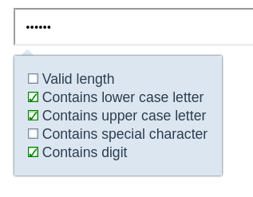

# Password Strength Checker
This is a [Vue 3](https://vuejs.org/) component for strength checking a [password input](https://developer.mozilla.org/en-US/docs/Web/HTML/Element/input/password), while providing hints on current requirements.

It uses [HTML 5](https://developer.mozilla.org/en-US/docs/Glossary/HTML5) Attributes - like maxLength, size, pattern - on a password input to validate the password. The `setCustomValidity` function from the [Constraint Validation API](https://developer.mozilla.org/en-US/docs/Web/API/Constraint_validation) is used to display a hint.

An `id` of a password input is required. A second, optional, id can be provided as `confirmId`, which refers to the password confirmation (retype password) input element. The password input elements aren't styled by default. To apply the `valid` and `invalid` state style, provide `pws` as an attribute on the primary password input and `pws-confirm` on the secondary input.

When the icon should be displayed on the right instead of the left, provide one of the following classes on the input: `.icon-right, .icon-right-1 .icon-right-2`. 

After mounting the component, the HTML Attributes are added to the input element and also listeners are attached for checking the password (`input`) and show(`focus`)/hide(`blur`) the hints.

Here are all component properties and their default values:
```json
for: null,
confirmId: null,
minLength: 10,
maxLength: 140,
needSpecialChar: true,
needLowerCaseChar: true,
needCapital: true,
needDigit: true,
backgroundColor: 'rgba(220, 230, 240, 1)',
boxShadow: '0 0 2px #2c3e50',
checkboxTransition: '0.6s',
passwordInputTransition: '0.4s'
```
The last 4 properties values are CSS values (`background`, `box-shadow`, `transition`).

Special characters are defined as follows and can be changed by providing a disjunction as regular expression:
```jsregexp
specialCharacters: /!|§|\$|%|&|\/|\(|\)|=|\?|\*|\+|~|#|-|_|\.|:|,|;|\^|°/
```

Inspect the password element with the used browser dev tools to see the html attributes set. When focusing the background changes to current validity state and the input element itself gets a hint attached. In addition, a container with all hints is shown beneath the password input.



